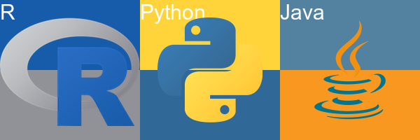

# Introduce to my meme
## Three programming language icons

1. **My meme**



2. **The r code for my meme**
```r
library(magick)

r_top_text <- image_blank(width = 200,
                          height = 100,
                          color = "#165CAA")


r_bottom_text <- image_blank(width = 200,
                             height = 100,
                             color = "#919198")

r_text <- c(r_top_text, r_bottom_text) %>%
  image_append(stack = TRUE) %>%
  image_annotate(text = "R",
                 size = 30,
                 gravity = "northwest",
                 color = "#ffffff")
r_icon <- image_read("https://www.r-project.org/Rlogo.png")

r_overlap_image <- image_composite(r_text,
                                   r_icon,
                                   offset = "+0+25")

python_top_text <- image_blank(width = 200,
                               height = 100,
                               color = "#FFD43B")


python_bottom_text <- image_blank(width = 200,
                                  height = 100,
                                  color = "#306998")
python_text <- c(python_top_text, python_bottom_text) %>%
  image_append(stack = TRUE) %>%
  image_annotate(text = "Python",
                 size = 30,
                 gravity = "northwest",
                 color = "#ffffff")

python_icon <- image_read("https://upload.wikimedia.org/wikipedia/commons/thumb/c/c3/Python-logo-notext.svg/1200px-Python-logo-notext.svg.png")
python_smaller_icon <- python_icon %>%
  image_scale(150)
python_overlap_image <- image_composite(python_text,
                                        python_smaller_icon,
                                        offset = "+25+25")


java_top_text <- image_blank(width = 200,
                             height = 100,
                             color = "#5382a1")


java_bottom_text <- image_blank(width = 200,
                                height = 100,
                                color = "#f89820")
java_text <- c(java_top_text, java_bottom_text) %>%
  image_append(stack = TRUE) %>%
  image_annotate(text = "Java",
                 size = 30,
                 gravity = "northwest",
                 color = "#ffffff")
java_icon <- image_read("https://brandlogos.net/wp-content/uploads/2021/11/java-logo.png")
java_smaller_icon <- java_icon %>%
  image_scale(200)
java_overlap_image <- image_composite(java_text,
                                      java_smaller_icon,
                                      offset = "+0+0")

final_image <- c(r_overlap_image, python_overlap_image, java_overlap_image) %>%
  image_append()
final_image
image_write(final_image, "myMeme.png")
```
3. **Why to create this meme?**
    - I learnt these 3 programming languages at stage 1 and 2.
    - I want to create an image for them.
4. **How was this meme created?**
    - This meme is made of 9 different images
    - Each promgramming language image contains 3 sub-images
    - The background color(2 images with different colors) and the language icon
    - Using ```image_composite()``` to combine the backgruond and the icon image on a specific position.
    - Finally, I uesd ```image_append()``` to put them together.
5. ***Fun stuff***
    - The relationship between background colors and icon colors.
